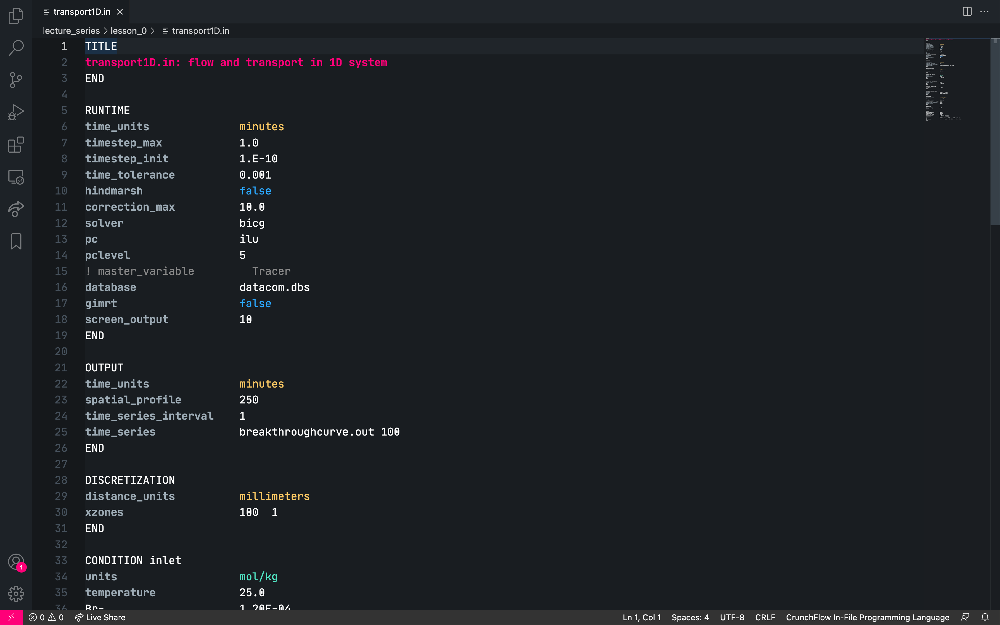

# CF-IF-LS README

This is the README for the CF-IF-LS i.e. the CrunchFlow In-File Language-Support extension for VS Code.

Curently, this VS Code extension is able to provide high-level syntax highlighting.

## Features

The syntax highlighting isn't overly sophisticated; colours are dependent upon the themes being utilised by the user's VS Code setup, syntax is set up to provide a bit of colour to:

* document title (e.g. transport1D.in)
* comments (e.g. !)
* boolean inputs (e.g. True|False)
* simple units (e.g. meters|seconds)
* complicated units (e.g. mol/kg|ppm)

An example of the extension at work is given below where the [zeit-theme-dark](https://github.com/lfades/vscode-zeit-theme) has been applied:

## Requirements

No real dependencies required, all you need to do is clone this repository and place the extension into the ~/.vscode/extensions folder of your local setup.

## Known Issues

* Commenting cannot yet be done outside of code blocks.

## Release Notes

### 1.0.0

Pilot release, this provides the base functionality of simple syntax highlighting.
* Added syntax support for all the code blocks and their relevant parameters.
* Added syntax support for all the simple distance and time units.
* Added syntax support for commenting out using !
* Added syntax support for boolean values being inputted.
* Added syntax support for some of the more complex units.